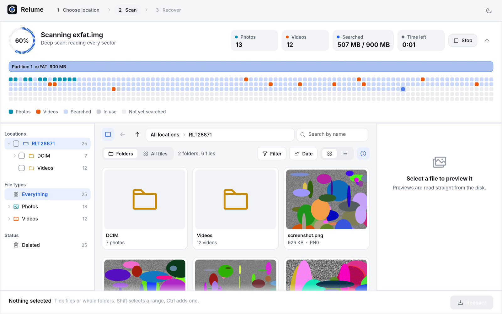
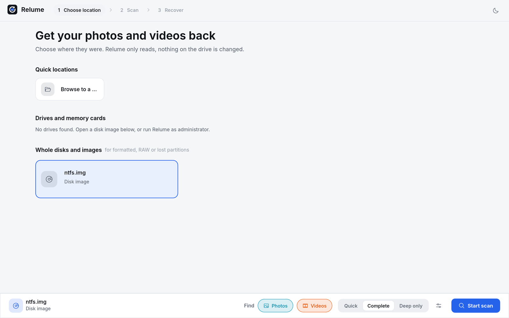
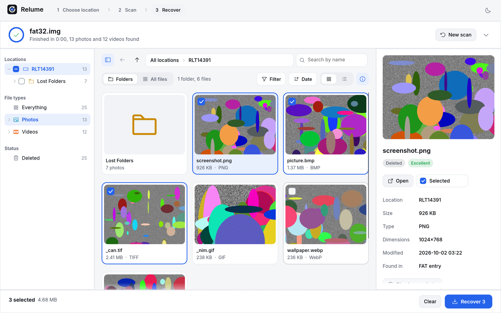
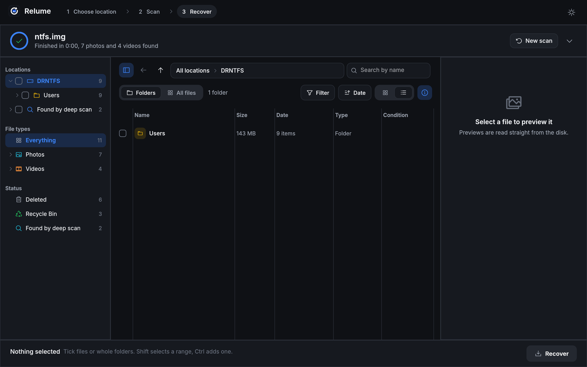

<p align="center">
  
</p>

<h1 align="center">Relume</h1>

<p align="center">
  <b>Get deleted photos and videos back on Windows.</b><br>
  Free, portable, read-only. A fast alternative to EaseUS Data Recovery Wizard,
  built to find more than Recuva and to show you exactly what you'll get back.
</p>

<p align="center">
  <a href="https://github.com/mogheess/relume/releases/latest/download/Relume.exe"><b>Download for Windows</b></a>
  &nbsp;·&nbsp;
  <a href="https://github.com/mogheess/relume/releases/latest">All downloads</a>
  &nbsp;·&nbsp;
  <a href="https://ko-fi.com/moghees">Support on Ko-fi</a>
</p>

<p align="center">
  
</p>

## Highlights

- **Finds what other tools miss.** Reads file system records (NTFS, FAT32, exFAT) *and* searches
  every sector for photos and videos whose records are gone, after formatting, corruption or
  overwritten folders.
- **Honest previews.** Every file is checked against the bytes actually on the disk and labelled
  Excellent, Good, Damaged or Overwritten. Previews are decoded straight from the drive, so a good
  preview means a good recovery.
- **Browse like File Explorer.** Results keep their original folders. Use breadcrumbs, back and up,
  and double-click folders, deleted ones included. Or flip to a flat "All files" view.
- **Watch the scan.** A live map of the drive shows its partitions, what has been searched, space
  in use, and where photos and videos turn up.
- **Recycle Bin, restored properly.** Files from an emptied Recycle Bin come back with their
  original names and folders.
- **Safe by design.** Never writes to the drive you scan, and warns you if you try to save
  recovered files onto it.

## Screenshots

| Choose where to look | Browse and select |
|---|---|
|  |  |

<p align="center"></p>

## Why it beats Recuva

Recuva mostly trusts file system records. If a record survives but its space was reused, or a
FAT32 card lost part of the start address on delete, Recuva shows a file name whose preview is
broken. Relume checks the real data and adds the techniques EaseUS class tools use.

| | Recuva | Relume |
|---|:---:|:---:|
| Deleted NTFS, FAT and exFAT entries | ✓ | ✓ |
| Deep scan for files with no records left (formatted, RAW, overwritten) | partial | ✓ 31 formats, fully validated |
| Fragmented NTFS files put back together | ✓ | ✓ |
| FAT32 start address repair (Windows wipes half of it on delete) | ✗ | ✓ |
| Orphaned folders (parent folder overwritten) | ✗ | ✓ with names |
| Emptied Recycle Bin restored to original name and folder | ✗ | ✓ |
| Lost or deleted partitions | ✗ | ✓ |
| Per-file condition from real structure checks | rough | ✓ |
| Partially overwritten videos detected (frame table checks) | ✗ | ✓ |

## Supported formats

**Photos:** JPEG (including multi-picture), PNG, GIF, BMP, TIFF, WebP, HEIC/HEIF, AVIF, PSD/PSB,
Canon CR2/CR3, Nikon NEF/NRW, Sony ARW, DNG, Olympus ORF, Panasonic RW2, Fujifilm RAF, Pentax PEF,
Samsung SRW.

**Videos:** MP4, MOV, M4V, 3GP, AVI (including files over 1 GB), MKV, WebM, WMV/ASF, FLV, MPEG/VOB,
MPEG-TS, AVCHD MTS/M2TS.

Photos show dimensions, camera and capture date. Videos show resolution, duration and codec.

## Download

**[Download Relume.exe](https://github.com/mogheess/relume/releases/latest/download/Relume.exe)**
for 64-bit Windows 10 or 11. No installer: just run it. The
[releases page](https://github.com/mogheess/relume/releases/latest) also has the command line
version, a zip with everything, and SHA256 checksums.

Windows may say **"Windows protected your PC"** because the app isn't code-signed yet. Click
**More info**, then **Run anyway**. Every release is built from this source by GitHub Actions.

## Getting started

1. Run **Relume.exe** and allow the administrator prompt. Windows only lets administrators read
   drives directly. Relume only reads; it never changes the drive you scan.
2. Pick where the files were: a folder, the Recycle Bin, a drive or memory card, a whole disk for
   formatted or lost partitions, or a disk image.
3. Choose **Photos** and/or **Videos**, keep **Complete**, and press **Start scan**.
4. Browse the results, tick files or whole folders (Shift for a range, Ctrl for one more), and
   press **Recover**. Save to a different drive, such as a USB stick.

> **Tips.** Stop using the drive as soon as you notice the loss. SSDs usually erase deleted data
> within seconds (TRIM), and Relume tells you when that has happened. For BitLocker drives, scan
> the drive letter rather than the physical disk.

## Command line

Double-click **relume-cli.exe** for a guided, step by step recovery, or script it:

```bash
relume-cli list
relume-cli scan E: --out F:\Recovered
relume-cli scan \\.\PhysicalDrive2 --deep --videos -v
relume-cli scan D:\images\card.img --folder \DCIM --json results.json
```

It offers to restart as administrator when a drive needs it. Run `relume-cli --help` for all options.

## Safety and privacy

- **Read-only.** Drives are opened for reading only. Nothing on the source is modified.
- **Offline.** Relume makes no network connections and sends nothing anywhere.
- **Recovery is guarded.** It warns before saving onto the drive being recovered, because that
  can overwrite the files you want back.
- **Audited.** Dependencies are checked with `cargo audit` against the RustSec advisory database
  (no known vulnerabilities at the time of writing). Platform code that calls Windows APIs is
  limited to listing drives, raw reads, the administrator prompt, and opening previews.

## Building from source

Requires Rust 1.85 or newer.

```bash
cargo build --release
```

Cross-compile the Windows binaries from macOS or Linux (needs `mingw-w64`):

```bash
./build-windows.sh
```

Both produce `Relume.exe` and `relume-cli.exe`. Pushing a tag such as `v0.2.0` also builds a
Windows release on GitHub Actions and attaches the zip to the release.

## Testing

```bash
testdata/run_tests.sh
```

This creates FAT32, exFAT and NTFS disk images on macOS with real photos and videos, deletes
them in realistic ways (a fragmented video, an emptied Recycle Bin, an orphaned folder, injected
damage), runs the scanner, recovers everything and compares checksums with the originals. Every
deleted file comes back byte for byte on all three file systems, and all six damage scenarios are
flagged correctly. The NTFS image needs `ntfs-3g` built from source; see `testdata/make_ntfs.sh`.

## Project layout

```
core/      recovery engine (no UI)
  device     raw, sector-aligned, bad-sector tolerant reads; fragment-aware file streams
  partition  MBR (512 and 4K sectors), extended, GPT, unpartitioned space, backup boot sectors
  fs/        quick scan: NTFS (MFT, data runs, $Bitmap, Recycle Bin), FAT12/16/32, exFAT
  carve      deep scan: per-sector signatures, skips space used by existing files
  formats/   structure walkers: exact length, completeness, metadata, frame checks
  scan       orchestration and live events, lost partitions, orphaned folders
  recover    writing files, previews (embedded RAW previews, EXIF thumbnails)
gui/       desktop app (egui; DirectX 12 or Vulkan with OpenGL fallback; Windows codecs for HEIC)
cli/       guided and scriptable command line
testdata/  scripts that build test disk images and verify recovery
```

## Limitations

- Fragmented files with no surviving records (deep scan only) are recovered in one piece and
  marked Damaged rather than silently broken. NTFS and exFAT records handle fragmentation fine.
- NTFS-compressed and EFS-encrypted files are recovered as stored, and flagged.
- File systems: NTFS, FAT12/16/32, exFAT. Others (ReFS, APFS, ext4) get the deep scan only.
- HEIC and AVIF previews use the Windows HEIF Image Extension. Without it, use **Open**.

## Support Relume

Relume is free and always will be. If it got your photos back, you can say thanks with a coffee:

<a href="https://ko-fi.com/moghees"></a>

Stars, bug reports and sharing it with someone who just lost their photos help too.

## License

[MIT](LICENSE)
